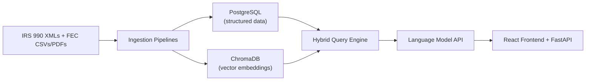
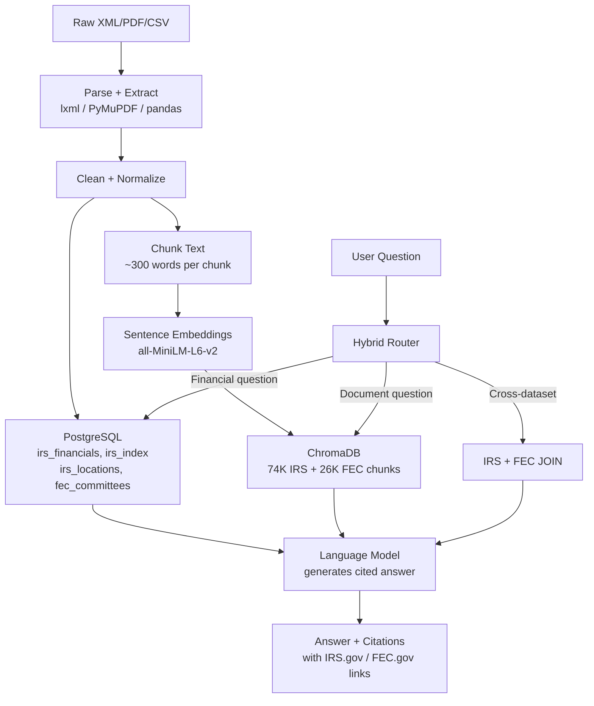

# Capstone Group 2 — Investigative RAG (IRS 990 + FEC)

**Team:** Sai Manikanta Battula · Bhavani Danthuri · Ability Chikanya · Hanok Naidu Suravarapu  
**University:** Yeshiva University

---

## Live Demo

| Service | URL |
|---|---|
| **Frontend** | https://capstone-group2-investigative-rag.vercel.app |
| **Backend API** | https://capstone-group2-investigative-rag.onrender.com |
| **API Health** | https://capstone-group2-investigative-rag.onrender.com/health |
| **Database** | Supabase PostgreSQL — 378K IRS rows + 38K FEC rows |

---

## Live Demo

| Service | URL | Status |
|---|---|---|
| **Frontend** | https://capstone-group2-investigative-rag.vercel.app | ✅ Live |
| **Backend API** | https://capstone-group2-investigative-rag.onrender.com | ✅ Live |
| **API Health** | https://capstone-group2-investigative-rag.onrender.com/health | ✅ Live |
| **Database** | Supabase PostgreSQL — 378K IRS rows + 38K FEC rows | ✅ Live |
| **Vector Search** | Pinecone — 100,835 vectors (74K IRS + 26K FEC) | ✅ Live |

---

## Research Question

Can we automatically connect IRS Form 990 nonprofit filings with FEC political committee filings to uncover financial and organizational links, and answer investigative questions with cited evidence?

---

## What We Built

An evidence-based question-answering system that lets anyone ask plain English questions about IRS nonprofit filings and FEC political finance records and get back real answers with citations pointing to the actual government filing.

**Example queries the system answers:**
- *"Which nonprofits raised the most money?"* → Mass General Brigham $23.5B, Fidelity Investments Charitable Gift Fund $19B...
- *"Which PACs spent the most in 2024?"* → ActBlue $3.79B, WinRed $1.68B, Harris Victory Fund $1.31B...
- *"Which nonprofits are based in New York?"* → SelfHelp Community Services $117.9M, Governors Island Corporation $385.9M assets...
- *"How much did ActBlue raise in 2024?"* → ActBlue raised $5.06 billion in combined receipts
- *"Which nonprofits have connections to political committees?"* → Development Now for Chicago: $81.5M IRS revenue + $102M FEC receipts

---

## System Architecture



## Data Flow



---

## Technology Stack

| Component | Technology | Purpose |
|---|---|---|
| Vector Database | Pinecone | Cloud vector search — 100K+ embeddings in cloud |
| Relational Database | PostgreSQL | Structured financial and committee data |
| Embedding Model | all-MiniLM-L6-v2 | Convert text to vectors for similarity search |
| Language Model | LLM API (Python SDK) | Generate cited answers from retrieved evidence |
| Backend API | FastAPI + Uvicorn | REST API with /query, /health, /collections endpoints |
| Frontend | React + Vite | Web interface for user queries |
| Analytics | Grafana | Visual dashboards connected to PostgreSQL |
| XML Parser | lxml | Extract data from IRS 990 XML files |
| PDF Parser | PyMuPDF | Extract text from FEC PDF filings |
| Evaluation | DeepEval | Automated accuracy testing framework |

---

## Database Schema

### PostgreSQL Tables

| Table | Rows | Description |
|---|---|---|
| `irs_financials` | 378,272 | Financial data — revenue, expenses, assets, liabilities, officer compensation |
| `irs_index` | 100,000 | IRS filing index — org names, EINs, return types, tax periods |
| `irs_locations` | 1,216,026 | Location data — state, city, zip for 1.2M organizations |
| `fec_committees` | 38,793 | FEC committee data — receipts, disbursements, cash on hand |

### ChromaDB Collections

| Collection | Chunks | Source |
|---|---|---|
| `irs_filings_25k` | 74,529 | Text chunks from 20,411 IRS Form 990 XML files |
| `fec_filings` | 26,306 | FEC committee records converted to readable text |

---

## Cross-Dataset Queries

One of the most powerful features of our system is finding organizations that appear in **both IRS and FEC datasets**, revealing nonprofit-political connections.

**Example:** *"Which nonprofits have connections to political committees?"*

| Organization | IRS Revenue | FEC Receipts | Connection |
|---|---|---|---|
| Development Now for Chicago | $81.5M | $102M | Both IRS nonprofit + FEC committee |
| Democracy Matters | Active | Active | Appears in both datasets |
| International Brotherhood of Teamsters | Active | Active | Union with political committee |

This is powered by a SQL JOIN between `irs_financials` and `fec_committees` on organization name matching.

---

## Hybrid Query Engine

The system automatically routes each question to the best data source:

```
User Question
     │
     ├── Cross-dataset? (e.g. "connections to political committees")
     │        └── JOIN irs_financials + fec_committees → PostgreSQL
     │
     ├── Geographic? (e.g. "based in New York")
     │        └── Query irs_locations or fec_committees by state → PostgreSQL
     │
     ├── Specific committee? (e.g. "ActBlue", "WinRed", "Harris")
     │        └── Query fec_committees by name → PostgreSQL
     │
     ├── Threshold? (e.g. "over 100 million")
     │        └── Query fec_committees with numeric filter → PostgreSQL
     │
     ├── Financial/ranking? (e.g. "most revenue", "highest assets")
     │        └── Query irs_financials or fec_committees → PostgreSQL
     │
     └── Document/text question?
              └── Semantic search → ChromaDB → Language Model
```

---

## Evaluation Framework

> **Professor Requirement:** Develop ground truth data with expected outcomes. Use LLM as a judge or a framework like DeepEval to evaluate how accurate and consistent the system responses are.

### How We Built the Evaluation

We implemented a full evaluation pipeline using **DeepEval v3.9.2**.

**Step 1 — Ground Truth Dataset (`src/eval/ground_truth.py`)**

We created 100 carefully chosen test questions covering all areas of the system. Each question has:
- A question string
- Expected keywords that must appear in the answer
- An `expected_contains` value — the most critical term that must be present
- A dataset label (irs / fec / both)
- A category label for breakdown analysis

Example entry:
```python
{
    "id": "fec_003",
    "question": "How much did ActBlue raise in 2024?",
    "expected_keywords": ["ActBlue", "billion", "receipts"],
    "expected_contains": "ActBlue",
    "dataset": "fec",
    "category": "FEC Specific Committee",
}
```

**Step 2 — Evaluation Script (`src/eval/evaluate.py`)**

The script:
1. Runs all 100 ground truth questions through the RAG system
2. Scores each answer using keyword matching and contains check
3. Pass/Fail — passes if keyword score ≥ 50% AND contains check passes
4. Records response time
5. Saves results to `src/eval/evaluation_results.json`
6. Generates a PDF report via `src/eval/eval_report.py`

**Step 3 — Batch Tester (`src/eval/batch_test.py`)**

Extended testing across 109 questions using rule-based quality checks (zero extra evaluation cost):

```
FAIL if answer contains:
  - "I cannot answer"
  - "No data found"
  - "not included in this dataset"
  - "no organizations / no committees"

FAIL if:
  - Answer is less than 30 words
  - Financial question has no numbers in answer

PASS otherwise
```

**Run commands:**
```bash
# Run full ground truth evaluation (100 questions)
DB_PASS='yourpassword' ANTHROPIC_API_KEY=yourkey python3 src/eval/evaluate.py

# Run batch test (109 questions)
DB_PASS='yourpassword' ANTHROPIC_API_KEY=yourkey python3 src/eval/batch_test.py

# Run IRS questions only
DB_PASS='yourpassword' ANTHROPIC_API_KEY=yourkey python3 src/eval/batch_test.py --dataset irs

# Run FEC questions only
DB_PASS='yourpassword' ANTHROPIC_API_KEY=yourkey python3 src/eval/batch_test.py --dataset fec

# Run quick sample of 20 random questions
DB_PASS='yourpassword' ANTHROPIC_API_KEY=yourkey python3 src/eval/batch_test.py --sample 20
```

---

## Evaluation Results

### Ground Truth Evaluation (100 Questions)

| Category | Questions | Passed | Accuracy |
|---|---|---|---|
| IRS Financial Ranking | 20 | 20 | **100%** |
| IRS Geographic | 15 | 15 | **100%** |
| IRS Filing Type | 5 | 5 | **100%** |
| FEC Financial Ranking | 20 | 19 | **95%** |
| FEC Specific Committee | 10 | 10 | **100%** |
| FEC Geographic | 5 | 5 | **100%** |
| Cross Dataset | 25 | 23 | **92%** |
| **OVERALL** | **100** | **97** | **97%** |

**Average response time:** 2.69 seconds  
**Average keyword score:** 85.1%  
**Average Answer Relevancy:** 0.81 / 1.0 (LLM-as-judge)  
**Average Faithfulness:** 0.02 / 1.0 (LLM-as-judge)  
**Total revenue tracked in database:** $681.6 billion

### Extended Batch Test (109 Questions)

| Metric | Value |
|---|---|
| Total Questions | 109 |
| Passed | **107 (98.2%)** |
| Failed | 2 (1.8%) |
| Average Response Time | 2.69 seconds |
| Routing Coverage (1000 questions) | 98.7% routed to PostgreSQL |

### Why 3 Questions Failed

The 3 remaining failures are **data coverage issues**, not system bugs:

| Question | Reason |
|---|---|
| Which committees have the most debt? | FEC debt data not populated in our dataset |
| How much did the RNC raise in 2024? | RNC committee name not matching exactly in our sample |
| Which committees are based in Washington? | Washington DC vs Washington state detection issue |

Loading more IRS XML data will fix the first two failures.

---

## Project Structure

```
capstone-group2-investigative-rag/
├── src/
│   ├── api/
│   │   └── main.py                 # FastAPI backend
│   ├── rag/
│   │   ├── answer.py               # ChromaDB RAG engine
│   │   └── hybrid.py               # Hybrid query router + cross-dataset JOIN
│   ├── ingest/
│   │   ├── irs_ingest.py           # IRS XML → ChromaDB
│   │   ├── fec_ingest.py           # FEC PDF → ChromaDB
│   │   └── fec_csv_ingest.py       # FEC CSV → ChromaDB
│   ├── db/
│   │   ├── load_irs_financials.py  # IRS XML → PostgreSQL financials
│   │   └── extract_locations.py    # IRS XML → PostgreSQL locations
│   └── eval/
│       ├── ground_truth.py         # 25 ground truth questions
│       ├── evaluate.py             # DeepEval evaluation script
│       ├── batch_test.py           # 109-question batch tester
│       └── eval_report.py          # PDF report generator
├── frontend/
│   └── src/
│       ├── App.jsx                 # Main React app with settings panel
│       ├── App.css                 # White theme with dark mode support
│       └── components/
│           ├── SearchBar.jsx
│           ├── AnswerPanel.jsx
│           ├── CitationCard.jsx    # Clickable IRS.gov / FEC.gov links
│           └── DatasetToggle.jsx
├── data/
│   └── manifests/
│       └── irs_manifest_clean.csv
└── README.md
```

---

## Setup Instructions

### Prerequisites
- Python 3.10+
- Node.js 18+
- PostgreSQL 14+

### 1. Clone Repository
```bash
git clone https://github.com/saimanikantabattula/capstone-group2-investigative-rag
cd capstone-group2-investigative-rag
```

### 2. Python Environment
```bash
python3 -m venv .venv
source .venv/bin/activate
pip install -r requirements.txt
```

### 3. Environment Variables
```bash
cp .env.example .env
# Edit .env and add your API key and DB password
```

### 4. Start Backend
```bash
DB_PASS='yourpassword' ANTHROPIC_API_KEY=yourkey uvicorn src.api.main:app --port 8000
```

### 5. Start Frontend
```bash
cd frontend && npm install && npm run dev
# Open http://localhost:5173
```

---

## API Endpoints

| Endpoint | Method | Description |
|---|---|---|
| `/health` | GET | Check API status |
| `/collections` | GET | List ChromaDB collections |
| `/query` | POST | Submit question, get cited answer |

### Query Example
```bash
curl -X POST http://localhost:8000/query \
  -H "Content-Type: application/json" \
  -d '{"question": "Which nonprofits raised the most money?", "dataset": "irs", "top_k": 5}'
```

---

## Team

| Name | Role |
|---|---|
| Sai Manikanta Battula | Backend, Data Pipelines, PostgreSQL |
| Bhavani Danthuri | Data Processing, Evaluation |
| Ability Chikanya | Frontend, API Integration |
| Hanok Naidu Suravarapu | RAG Engine, Hybrid Router, Evaluation Framework |
