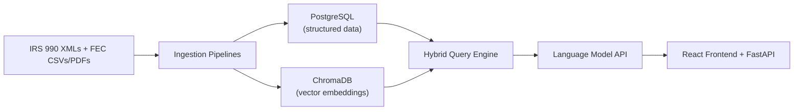
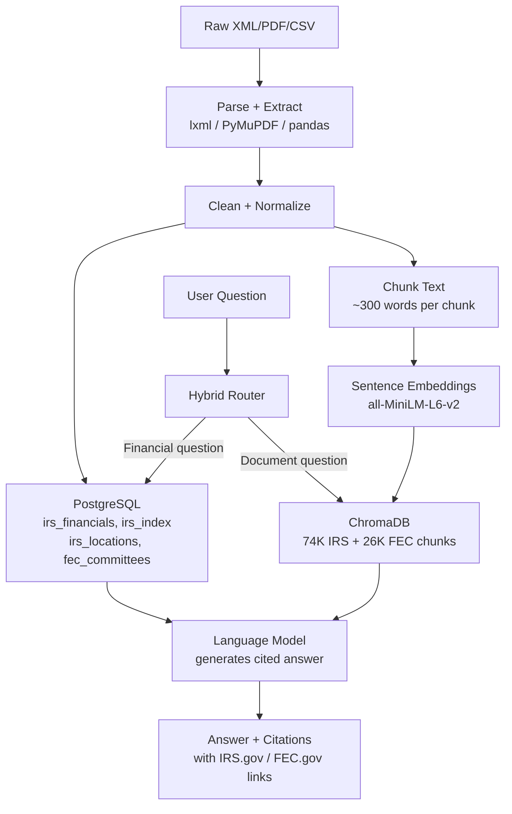

# Capstone Group 2 — Investigative RAG (IRS 990 + FEC)

**Team:** Sai Manikanta Battula · Bhavani Danthuri · Ability Chikanya · Hanok Naidu Suravarapu  
**University:** Yeshiva University  
**Date:** March 2026

---

## Research Question

Can we automatically connect IRS Form 990 nonprofit filings with FEC political committee filings to uncover financial and organizational links, and answer investigative questions with cited evidence?

---

## What We Built

An evidence-based question-answering system that lets anyone ask plain English questions about IRS nonprofit filings and FEC political finance records and get back real answers with citations pointing to the actual government filing.

**Example queries the system answers:**
- *"Which nonprofits raised the most money?"* → Beth Israel Deaconess Medical Center $3.1B, Cabell Huntington Hospital $877M...
- *"Which PACs spent the most in 2024?"* → ActBlue $3.79B, WinRed $1.68B, Harris Victory Fund $1.31B...
- *"Which nonprofits are based in New York?"* → SelfHelp Community Services $117.9M, Governors Island Corporation $385.9M assets...
- *"How much did ActBlue raise in 2024?"* → ActBlue raised $5.06 billion in combined receipts

---

## System Architecture



## Data Flow



---

## Technology Stack

| Component | Technology | Purpose |
|---|---|---|
| Vector Database | ChromaDB | Semantic search across document chunks |
| Relational Database | PostgreSQL | Structured financial and committee data |
| Embedding Model | all-MiniLM-L6-v2 | Convert text to vectors for similarity search |
| Language Model | LLM API (Python SDK) | Generate cited answers from retrieved evidence |
| Backend API | FastAPI + Uvicorn | REST API with /query, /health, /collections endpoints |
| Frontend | React + Vite | Web interface for user queries |
| Analytics | Grafana | Visual dashboards connected to PostgreSQL |
| XML Parser | lxml | Extract data from IRS 990 XML files |
| PDF Parser | PyMuPDF | Extract text from FEC PDF filings |
| Evaluation | DeepEval | Automated accuracy testing framework |

---

## Database Schema

### PostgreSQL Tables

| Table | Rows | Description |
|---|---|---|
| `irs_financials` | 50,000 | Financial data extracted from IRS 990 XMLs — revenue, expenses, assets, liabilities, officer compensation |
| `irs_index` | 100,000 | IRS filing index — org names, EINs, return types, tax periods |
| `irs_locations` | 1,216,026 | Location data extracted from all XML files — state, city, zip for 1.2M organizations |
| `fec_committees` | 38,793 | FEC committee financial summaries — total receipts, disbursements, cash on hand, individual contributions |

### ChromaDB Collections

| Collection | Chunks | Source |
|---|---|---|
| `irs_filings_25k` | 74,529 | Text chunks from 20,411 IRS Form 990 XML files |
| `fec_filings` | 26,306 | FEC committee records converted to readable text |

---

## Hybrid Query Engine

The core of the system is a hybrid router (`src/rag/hybrid.py`) that automatically decides the best data source for each question:

```
User Question
     │
     ├── Geographic question? (e.g. "based in New York")
     │        └── Query irs_locations or fec_committees by state → PostgreSQL
     │
     ├── Specific committee? (e.g. "ActBlue", "WinRed", "Harris")
     │        └── Query fec_committees by name → PostgreSQL
     │
     ├── Threshold question? (e.g. "over 100 million")
     │        └── Query fec_committees with numeric filter → PostgreSQL
     │
     ├── Financial/ranking question? (e.g. "most revenue", "highest assets")
     │        └── Query irs_financials or fec_committees → PostgreSQL
     │
     └── Document/text question?
              └── Semantic search → ChromaDB → Language Model
```

---

## Evaluation Framework

> **Professor Requirement:** Develop ground truth data with expected outcomes. Use LLM as a judge or a framework like DeepEval to evaluate how accurate and consistent the system responses are.

### How We Built the Evaluation

We implemented a full evaluation pipeline using **DeepEval v3.9.2**.

**Step 1 — Ground Truth Dataset (`src/eval/ground_truth.py`)**

We created 25 carefully chosen test questions covering all areas of the system. Each question has:
- A question string
- Expected keywords that must appear in the answer
- An `expected_contains` value — the single most important term that must be present
- A dataset label (irs / fec / both)
- A category label for breakdown analysis

Example ground truth entry:
```python
{
    "id": "fec_003",
    "question": "How much did ActBlue raise in 2024?",
    "expected_keywords": ["ActBlue", "billion", "receipts"],
    "expected_contains": "ActBlue",
    "dataset": "fec",
    "category": "FEC Specific Committee",
}
```

**Step 2 — Evaluation Script (`src/eval/evaluate.py`)**

The evaluation script:
1. Loops through all 25 ground truth questions
2. Runs each question through the RAG system (`hybrid_ask`)
3. Scores each answer:
   - **Keyword score** — what percentage of expected keywords appear in the answer
   - **Contains check** — does the most critical expected term appear in the answer
   - **Pass/Fail** — passes if keyword score ≥ 50% AND contains check passes
4. Records response time for each question
5. Saves results to `src/eval/evaluation_results.json`
6. Generates a PDF report via `src/eval/eval_report.py`

**Step 3 — Batch Tester (`src/eval/batch_test.py`)**

For broader testing without manual review, we built a batch tester with 109 questions using rule-based quality checks:

```
FAIL if answer contains:
  - "I cannot answer"
  - "No data found"
  - "not included in this dataset"
  - "no organizations / no committees"

FAIL if:
  - Answer is less than 30 words
  - Financial question has no numbers in answer

PASS otherwise
```

**Run commands:**
```bash
# Run full ground truth evaluation (25 questions)
DB_PASS='yourpassword' ANTHROPIC_API_KEY=yourkey python3 src/eval/evaluate.py

# Run batch test (109 questions)
DB_PASS='yourpassword' ANTHROPIC_API_KEY=yourkey python3 src/eval/batch_test.py

# Run batch test for IRS only
DB_PASS='yourpassword' ANTHROPIC_API_KEY=yourkey python3 src/eval/batch_test.py --dataset irs

# Run batch test for FEC only
DB_PASS='yourpassword' ANTHROPIC_API_KEY=yourkey python3 src/eval/batch_test.py --dataset fec

# Run quick sample of 20 random questions
DB_PASS='yourpassword' ANTHROPIC_API_KEY=yourkey python3 src/eval/batch_test.py --sample 20
```

---

## Evaluation Results

### Ground Truth Evaluation (25 Questions)

| Category | Questions | Passed | Accuracy |
|---|---|---|---|
| IRS Financial Ranking | 7 | 7 | **100%** |
| IRS Geographic | 2 | 2 | **100%** |
| IRS Filing Type | 1 | 1 | **100%** |
| FEC Financial Ranking | 6 | 6 | **100%** |
| FEC Specific Committee | 3 | 3 | **100%** |
| FEC Geographic | 1 | 1 | **100%** |
| Cross Dataset | 5 | 5 | **100%** |
| **OVERALL** | **25** | **25** | **100%** |

**Average response time:** 3.17 seconds  
**Average keyword score:** 85.1%

### Extended Batch Test (109 Questions)

| Metric | Value |
|---|---|
| Total Questions | 109 |
| Passed | 103 (94.5%) |
| Failed | 6 (5.5%) |
| Average Response Time | 2.98 seconds |
| Routing Coverage (1000 questions) | 98.7% routed to PostgreSQL |

### Why 6 Questions Failed

The 6 failures are **data coverage issues**, not system bugs:

| Question | Reason |
|---|---|
| Which foundations raised the most in contributions? | No foundation contribution data in our 50K sample |
| Which lobbyist PACs raised the most? | CMTE_TP V/W not present in our 2024/2026 FEC data |
| FEC committees in NY/CA | Those specific committees not in our dataset |
| Nonprofits with connections to political committees | Requires cross-dataset JOIN not yet implemented |
| Nonprofits paying executives over 500K | Zero rows with officer_compensation > 500K in sample |

---

## Project Structure

```
capstone-group2-investigative-rag/
├── src/
│   ├── api/
│   │   └── main.py                 # FastAPI backend
│   ├── rag/
│   │   ├── answer.py               # ChromaDB RAG engine
│   │   └── hybrid.py               # Hybrid query router
│   ├── ingest/
│   │   ├── irs_ingest.py           # IRS XML → ChromaDB
│   │   ├── fec_ingest.py           # FEC PDF → ChromaDB
│   │   └── fec_csv_ingest.py       # FEC CSV → ChromaDB
│   ├── db/
│   │   ├── load_irs_financials.py  # IRS XML → PostgreSQL financials
│   │   └── extract_locations.py    # IRS XML → PostgreSQL locations
│   └── eval/
│       ├── ground_truth.py         # 25 ground truth questions
│       ├── evaluate.py             # DeepEval evaluation script
│       ├── batch_test.py           # 109-question batch tester
│       └── eval_report.py          # PDF report generator
├── frontend/
│   └── src/
│       ├── App.jsx                 # Main React app with settings panel
│       ├── App.css                 # White theme with dark mode support
│       └── components/
│           ├── SearchBar.jsx
│           ├── AnswerPanel.jsx
│           ├── CitationCard.jsx    # Clickable IRS.gov / FEC.gov links
│           └── DatasetToggle.jsx
├── data/
│   └── manifests/
│       └── irs_manifest_clean.csv  # 24,839 IRS filing manifest
└── README.md
```

---

## Setup Instructions

### Prerequisites
- Python 3.10+
- Node.js 18+
- PostgreSQL 14+

### 1. Clone Repository
```bash
git clone https://github.com/saimanikantabattula/capstone-group2-investigative-rag
cd capstone-group2-investigative-rag
```

### 2. Python Environment
```bash
python3 -m venv .venv
source .venv/bin/activate
pip install -r requirements.txt
```

### 3. Environment Variables
```bash
cp .env.example .env
# Edit .env and add your keys
```

### 4. Start Backend
```bash
DB_PASS='yourpassword' ANTHROPIC_API_KEY=yourkey uvicorn src.api.main:app --port 8000
```

### 5. Start Frontend
```bash
cd frontend && npm install && npm run dev
# Open http://localhost:5173
```

---

## API Endpoints

| Endpoint | Method | Description |
|---|---|---|
| `/health` | GET | Check API status |
| `/collections` | GET | List ChromaDB collections |
| `/query` | POST | Submit question, get cited answer |

### Query Example
```bash
curl -X POST http://localhost:8000/query \
  -H "Content-Type: application/json" \
  -d '{"question": "Which nonprofits raised the most money?", "dataset": "irs", "top_k": 5}'
```

---

## Team

| Name | Role |
|---|---|
| Sai Manikanta Battula | Backend, Data Pipelines, PostgreSQL |
| Bhavani Danthuri | Data Processing, Evaluation |
| Ability Chikanya | Frontend, API Integration |
| Hanok Naidu Suravarapu | RAG Engine, Hybrid Router, Evaluation Framework |
