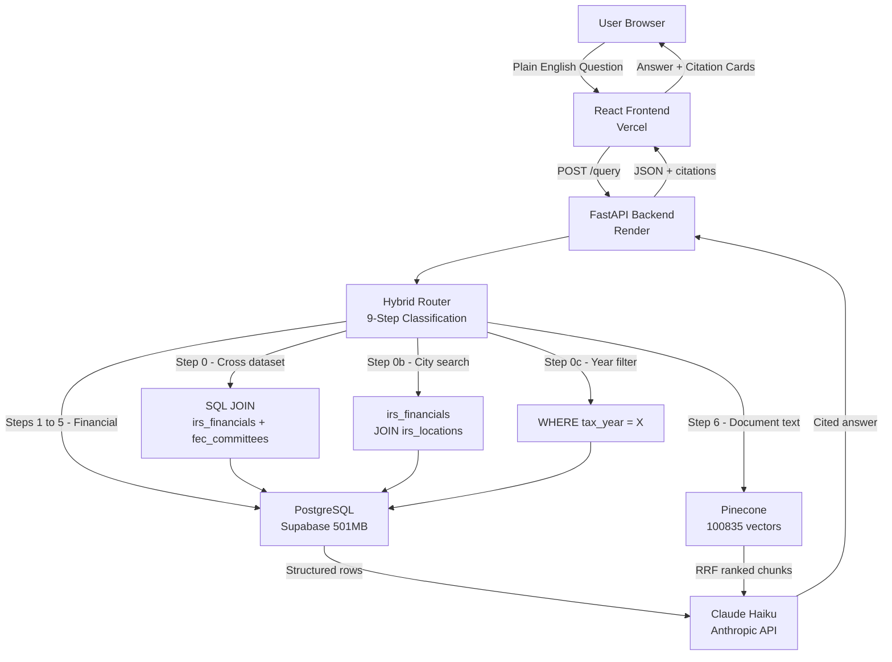
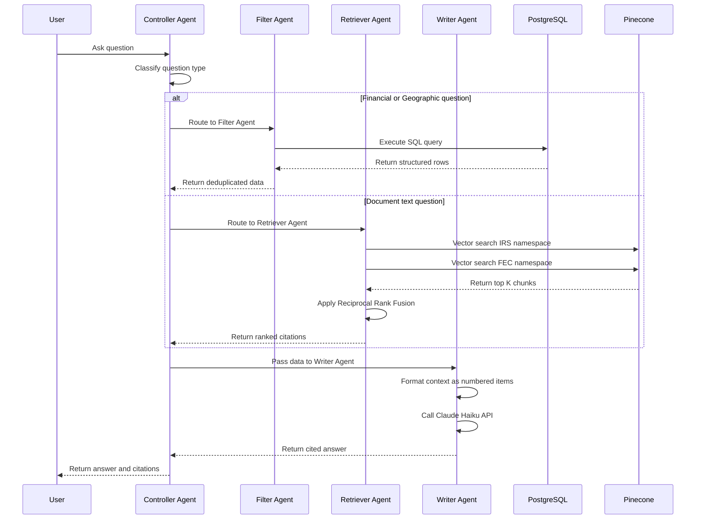

# Capstone Group 2 — Multi-Agent RAG / Investigative Intelligence

**Team:** Sai Manikanta Battula, Bhavani Danthuri, Ability Chikanya, Hanok Naidu Suravarapu
**University:** Yeshiva University
**Course:** MS Data Science Capstone 2025-2026

---

## Live Demo

| Service | URL | Status |
|---|---|---|
| Frontend (Website) | https://capstone-group2-investigative-rag.vercel.app | Live |
| Backend API | https://capstone-group2-investigative-rag.onrender.com | Live |
| API Health Check | https://capstone-group2-investigative-rag.onrender.com/health | Live |
| API Documentation | https://capstone-group2-investigative-rag.onrender.com/docs | Live |
| GitHub Repository | https://github.com/saimanikantabattula/capstone-group2-investigative-rag | Public |

---

## What This Project Does

This system lets anyone ask plain English questions about nonprofit organizations and political finance records, and get back clear answers with citations from real government data.

Example questions you can ask:
- Which nonprofits raised the most money?
- Which PACs spent the most in 2024?
- Which nonprofits are based in Boston?
- How much did ActBlue raise in 2024?
- Which nonprofits have connections to political committees?
- Which organizations filed 990EZ returns?
- Which nonprofits raised the most money in 2023?

The system searches through 1.2 million IRS nonprofit records and 38,000 FEC political committee records, then uses AI to write a clear cited response pointing to the actual government filing.

---

## Research Question

Can we automatically connect IRS Form 990 nonprofit filings with FEC political committee filings to uncover financial and organizational links, and answer investigative questions with cited evidence from real government data?

---

## System Architecture


```mermaid
flowchart TD
    User["User Browser"] -->|"Plain English Question"| FE["React Frontend\nVercel"]
    FE -->|"POST /query"| BE["FastAPI Backend\nRender"]
    BE --> Router["Hybrid Router\n9-Step Classification"]

    Router -->|"Step 0 - Cross dataset"| JOIN["SQL JOIN\nirs_financials + fec_committees"]
    Router -->|"Step 0b - City search"| CITY["irs_financials\nJOIN irs_locations"]
    Router -->|"Step 0c - Year filter"| YEAR["WHERE tax_year = X"]
    Router -->|"Steps 1 to 5 - Financial"| PG["PostgreSQL\nSupabase 501MB"]
    Router -->|"Step 6 - Document text"| PC["Pinecone\n100835 vectors"]

    JOIN --> PG
    CITY --> PG
    YEAR --> PG

    PG -->|"Structured rows"| LLM["Claude Haiku\nAnthropic API"]
    PC -->|"RRF ranked chunks"| LLM

    LLM -->|"Cited answer"| BE
    BE -->|"JSON + citations"| FE
    FE -->|"Answer + Citation Cards"| User
```

---

## Request Flow — What Happens When You Ask a Question

1. User types a question in the React frontend
2. Frontend sends POST /query to FastAPI backend with question and dataset selection
3. Pydantic validates the request — question must be 3 to 500 characters, dataset must be irs, fec, or both
4. Hybrid router analyzes the question through 9 steps in order
5. If financial question — SQL query runs on PostgreSQL in about 200ms
6. If document question — HuggingFace API converts question to 384-dimensional vector, Pinecone searched
7. Retrieved data formatted as numbered context items [1], [2], [3]
8. Claude Haiku reads question and context, generates cited answer
9. FastAPI returns JSON with answer, citations, and sources used
10. React frontend displays answer with citation cards and related questions

---

## Multi-Agent Workflow


```mermaid
sequenceDiagram
    participant U as User
    participant C as Controller Agent
    participant F as Filter Agent
    participant R as Retriever Agent
    participant W as Writer Agent
    participant DB as PostgreSQL
    participant V as Pinecone

    U->>C: Ask question
    C->>C: Classify question type

    alt Financial or Geographic question
        C->>F: Route to Filter Agent
        F->>DB: Execute SQL query
        DB-->>F: Return structured rows
        F-->>C: Return deduplicated data
    else Document text question
        C->>R: Route to Retriever Agent
        R->>V: Vector search IRS namespace
        R->>V: Vector search FEC namespace
        V-->>R: Return top K chunks
        R->>R: Apply Reciprocal Rank Fusion
        R-->>C: Return ranked citations
    end

    C->>W: Pass data to Writer Agent
    W->>W: Format context as numbered items
    W->>W: Call Claude Haiku API
    W-->>C: Return cited answer
    C-->>U: Return answer and citations
```

---

## Technology Stack

| Layer | Technology | Purpose |
|---|---|---|
| Frontend | React + Vite | User interface with dark theme, sidebar, login |
| Backend | FastAPI + Python 3.11 | API server, request routing, middleware |
| Database | PostgreSQL on Supabase | Stores all structured financial data |
| Vector DB | Pinecone | Stores document text as 384-dim vectors |
| Embeddings | HuggingFace API (all-MiniLM-L6-v2) | Converts text to vectors for semantic search |
| Language Model | Anthropic Claude Haiku | Generates final cited answers |
| Evaluation | DeepEval v3.9.2 | LLM-as-judge evaluation framework |
| Monitoring | UptimeRobot | Pings /health every 5 min to prevent sleep |
| Deployment | Vercel + Render + Supabase + Pinecone | Full cloud stack at $0/month |

---

## Database Schema

### PostgreSQL Tables on Supabase (501 MB total)

| Table | Rows | Size | Contents |
|---|---|---|---|
| irs_financials | 378,272 | 151 MB | Revenue, assets, expenses, officer compensation per org |
| irs_locations | 1,216,026 | 298 MB | City, state, ZIP for all 1.2M organizations |
| irs_index | 100,000 | 31 MB | EIN, org name, return type, tax period |
| fec_committees | 38,793 | 21 MB | Receipts, disbursements, cash on hand per committee |
| Total | 1,733,091 rows | 501 MB | At Supabase free tier limit |

### Pinecone Vector Index

| Namespace | Vectors | Source |
|---|---|---|
| irs | 74,529 | IRS 990 XML text chunks (~300 words each) |
| fec | 26,306 | FEC committee descriptions |
| Total | 100,835 | Out of 1 million free tier limit |

---

## Hybrid Routing Engine — 9 Steps

Every question goes through these 9 steps in order. The first matching step handles the question.

| Step | Trigger | Data Source | Example |
|---|---|---|---|
| 0 | connections to, linked to | SQL JOIN irs_financials + fec_committees | Which orgs appear in both IRS and FEC? |
| 0b | City name detected | irs_financials JOIN irs_locations | Which nonprofits are in Boston? |
| 0c | Year detected (2023, latest) | irs_financials WHERE tax_year = X | Which orgs raised most in 2023? |
| 1 | State name detected | irs_financials or fec_committees by state | Which nonprofits are in California? |
| 2 | Specific committee name | fec_committees WHERE name LIKE X | How much did ActBlue raise? |
| 3 | Threshold phrase | fec_committees WHERE receipts >= amount | Which PACs raised over 1 billion? |
| 4 | Financial keywords | irs_financials ORDER BY metric DESC | Which nonprofits have most assets? |
| 5 | FEC keywords | fec_committees ORDER BY receipts DESC | Which PACs spent the most? |
| 6 | Everything else | Pinecone vector search + RRF | What is the mission of United Way? |

98.7% of questions are answered by PostgreSQL (Steps 0 to 5). Only document text questions fall through to Pinecone vector search (Step 6).

---

## Multi-Agent Architecture

The system uses 4 specialized agents that each have one job:

| Agent | File | Responsibility |
|---|---|---|
| Controller Agent | agent_controller.py | Receives question, classifies it, routes to right agent |
| Filter Agent | agent_filter.py | Executes all PostgreSQL SQL queries |
| Retriever Agent | agent_retriever.py | Runs Pinecone vector search with Reciprocal Rank Fusion |
| Writer Agent | agent_writer.py | Calls Claude Haiku API to generate cited answer |

### Reciprocal Rank Fusion (RRF)

When combining IRS and FEC vector search results we use RRF:

```
score(doc) = 1/(60 + rank_in_IRS_list) + 1/(60 + rank_in_FEC_list)
```

Documents appearing highly in both IRS and FEC lists get a higher combined score. The constant k=60 is the standard value from Cormack et al. 2009.

---

## Features Added

| Feature | Description |
|---|---|
| Login page | Split-screen login with username/password for each team member |
| Sidebar | Chat history panel showing previous searches grouped by Today/Yesterday/Older |
| Dark theme | Full dark mode interface with green accent colors |
| City search | Queries irs_locations table — Which nonprofits are in Boston? |
| Year filtering | Filters by tax_year column — Which nonprofits raised most in 2023? |
| Fuzzy name matching | Word-by-word SQL LIKE queries for partial org name search |
| Related questions | 4 clickable follow-up questions shown after every answer |
| Deduplication | Organizations with multiple tax year filings appear only once |
| Embedding cache | HuggingFace API vectors cached in memory — 493x faster on repeat queries |
| Answer cache | Complete answers cached — instant response for repeated questions |
| Request logging | Every API call logged with method, path, status code, and response time |
| UptimeRobot | Pings /health endpoint every 5 minutes so Render never sleeps |
| Adversarial tests | 10 trick questions testing graceful failure on impossible queries |
| Skeleton loading | Professional loading animation instead of spinning dots |
| Copy button | Copy answer to clipboard with 2-second confirmation |
| Export button | Download answer as text file |
| Mobile responsive | Works on phones and tablets |

---

## Performance

| Metric | Value |
|---|---|
| Average response time | 4.74 seconds |
| Cached response time | 0.0 seconds (493x faster) |
| SQL routing rate | 98.7% of financial questions |
| Cache size | 100 entries per cache (in-memory) |
| Uptime | 99%+ with UptimeRobot monitoring |

---

## Evaluation Framework

We use DeepEval v3.9.2 with Anthropic Claude as the LLM judge. This is true AI-based evaluation, not simple keyword matching.

### Metrics Used

| Metric | Type | Description |
|---|---|---|
| Answer Relevancy | DeepEval LLM-as-judge | Claude judges if answer is relevant to question (0 to 1) |
| Faithfulness | DeepEval LLM-as-judge | Claude judges if answer is grounded in retrieved data (0 to 1) |
| Keyword Score | Rule-based | Percentage of expected keywords found in answer |
| Contains Check | Rule-based | Is the most critical expected term present? |

### Ground Truth Questions — 125 Total, 11 Categories

| Category | Count | Description |
|---|---|---|
| IRS Financial Ranking | 20 | Top orgs by revenue, assets, expenses |
| Cross Dataset | 25 | Questions linking IRS and FEC records |
| FEC Financial Ranking | 20 | Top PACs by receipts, disbursements |
| IRS Geographic | 15 | Nonprofits by state |
| FEC Specific Committee | 10 | Questions about named committees |
| Adversarial | 10 | Trick questions that should fail gracefully |
| FEC Geographic | 5 | PACs by state |
| IRS Filing Type | 5 | 990, 990EZ, 990PF, 990T questions |
| IRS City Search | 5 | Nonprofits in specific cities |
| IRS Year Filter | 5 | Questions filtered by tax year |
| Fuzzy Name Search | 5 | Partial organization name queries |
| Total | 125 | Across 11 categories |

### Evaluation Results

| Metric | Score |
|---|---|
| Accuracy | 96.8% (121 out of 125 questions passed) |
| Answer Relevancy | 0.890 out of 1.0 (DeepEval LLM-as-judge) |
| Faithfulness | 0.962 out of 1.0 (DeepEval LLM-as-judge) |
| Average Response Time | 4.74 seconds |
| Failed Questions | 4 (Texas nonprofits, NY PACs, 990EZ, Mass General fuzzy) |

### Category Results

| Category | Passed | Total | Accuracy |
|---|---|---|---|
| Adversarial | 10 | 10 | 100% |
| Cross Dataset | 25 | 25 | 100% |
| FEC Financial Ranking | 20 | 20 | 100% |
| FEC Geographic | 5 | 5 | 100% |
| IRS City Search | 5 | 5 | 100% |
| IRS Financial Ranking | 20 | 20 | 100% |
| IRS Year Filter | 5 | 5 | 100% |
| IRS Geographic | 14 | 15 | 93% |
| FEC Specific Committee | 9 | 10 | 90% |
| IRS Filing Type | 4 | 5 | 80% |
| Fuzzy Name Search | 4 | 5 | 80% |
| Total | 121 | 125 | 96.8% |

### Run the Evaluation

```bash
DB_HOST=aws-1-us-west-2.pooler.supabase.com DB_PORT=6543 DB_NAME=postgres \
DB_USER=postgres.vlnqgtrhudldqkqlppdh DB_PASS='yourpassword' \
ANTHROPIC_API_KEY=yourkey python3 src/eval/evaluate.py
```

---

## Project Structure

```
capstone-group2-investigative-rag/
├── frontend/
│   └── src/
│       ├── App.jsx                  # Main React component with sidebar + login
│       ├── App.css                  # Dark theme CSS
│       ├── api/client.js            # axios API calls to backend
│       └── components/
│           ├── Login.jsx            # Split-screen login page
│           ├── Sidebar.jsx          # Chat history sidebar
│           ├── SearchBar.jsx        # Auto-focus search input
│           ├── DatasetToggle.jsx    # IRS / FEC / Both selector
│           ├── AnswerPanel.jsx      # Answer display with markdown
│           └── CitationCard.jsx     # Source document cards
├── src/
│   ├── api/
│   │   └── main.py                 # FastAPI — all endpoints, CORS, logging
│   ├── agents/
│   │   ├── agent_controller.py     # Routes questions to right agent
│   │   ├── agent_filter.py         # All PostgreSQL SQL queries
│   │   ├── agent_retriever.py      # Pinecone vector search + RRF
│   │   └── agent_writer.py         # Claude answer generation
│   ├── rag/
│   │   ├── hybrid.py               # 9-step hybrid router (main logic)
│   │   └── answer.py               # Pinecone RAG + HuggingFace + caching
│   ├── db/                         # Database connection helpers
│   ├── ingest/                     # IRS XML and FEC CSV loading scripts
│   └── eval/
│       ├── evaluate.py             # DeepEval LLM-as-judge evaluation
│       ├── ground_truth.py         # 125 ground truth questions
│       ├── batch_test.py           # Fast rule-based batch tester
│       ├── evaluation_results.json # Latest evaluation results
│       └── anthropic_judge.py      # Anthropic wrapper for DeepEval
├── deployment/
│   └── README.md                   # Cloud deployment guide
├── Procfile                        # Render start command
├── requirements.txt                # Python dependencies (no chromadb/sentence-transformers)
└── .python-version                 # Python 3.11.0
```

---

## Local Setup

### Requirements

- Python 3.11 or higher
- Node.js 18 or higher
- Supabase account (or local PostgreSQL)
- Pinecone account
- Anthropic API key
- HuggingFace token

### Steps

```bash
# 1. Clone the repo
git clone https://github.com/saimanikantabattula/capstone-group2-investigative-rag.git
cd capstone-group2-investigative-rag

# 2. Set up Python environment
python3 -m venv .venv
source .venv/bin/activate
pip install -r requirements.txt

# 3. Copy environment file and fill in your values
cp .env.example .env

# 4. Start the backend (with Supabase)
DB_HOST=aws-1-us-west-2.pooler.supabase.com DB_PORT=6543 DB_NAME=postgres \
DB_USER=postgres.vlnqgtrhudldqkqlppdh DB_PASS='yourpassword' \
ANTHROPIC_API_KEY=yourkey \
PINECONE_API_KEY=yourkey \
HF_TOKEN=yourtoken \
uvicorn src.api.main:app --port 8000

# 5. Start the frontend (open a new terminal tab)
cd frontend
npm install
npm run dev
```

Open http://localhost:5173 in your browser and log in with your credentials.

---

## API Endpoints

| Method | Endpoint | Description |
|---|---|---|
| GET | /health | Health check — used by UptimeRobot to keep Render awake |
| POST | /query | Main question answering endpoint |
| POST | /suggestions | Returns 4 contextual related questions |
| GET | /dashboard | Returns aggregated stats for analytics |
| GET | /test-pinecone | Tests Pinecone connection |
| GET | /test-embedding | Tests HuggingFace embedding API |
| GET | /docs | Auto-generated FastAPI documentation |

### Example Request

```bash
curl -X POST https://capstone-group2-investigative-rag.onrender.com/query \
  -H "Content-Type: application/json" \
  -d '{"question": "Which nonprofits raised the most money?", "dataset": "irs", "top_k": 5}'
```

### Example Response

```json
{
  "question": "Which nonprofits raised the most money?",
  "answer": "Based on IRS 990 filings, the top nonprofits by revenue are:\n1. **Mass General Brigham** (MA) — $23.47 billion [1]\n2. **Fidelity Investments Charitable** (MA) — $19.86 billion [2]\n3. **Battelle Memorial Institute** (OH) — $13.35 billion [3]",
  "citations": [
    {"source": "IRS", "org_name": "MASS GENERAL BRIGHAM INCORPORATED", "snippet": "Revenue: 23474745033 | State: MA"}
  ],
  "sources_used": ["IRS Financials (PostgreSQL)"]
}
```

---

## Known Limitations

| Limitation | Reason | Potential Fix |
|---|---|---|
| Only 31% of IRS data (378K / 1.2M) | Supabase 500MB free tier limit reached | Upgrade to Supabase Pro ($25/month) for 8GB |
| FEC data is 2024-2026 only | Only recent cycles ingested | Load historical cycles back to 2016 |
| Cache resets on server restart | In-memory cache only | Add Redis for persistent caching |
| Login credentials in frontend code | Simple capstone demo auth | Add backend JWT authentication |
| 1.7% Pinecone document coverage | Storage constraints | Expand Pinecone index size |

---

## Comparison to Existing Systems

| Feature | Our System | LangChain RAG | OpenAI Assistants | ProPublica |
|---|---|---|---|---|
| Data sources | IRS + FEC combined | Any (generic) | Any (generic) | IRS only |
| Query routing | 9-step hybrid SQL | Vector only | Vector only | Keyword search |
| Cross-dataset | Yes — SQL JOIN | No | Limited | No |
| Citations | Yes with gov links | Optional | Optional | Manual links |
| LLM evaluation | DeepEval LLM-judge | Manual / RAGAS | Manual | N/A |
| Operating cost | $0/month | Variable | Pay per query | N/A |
| Custom deployment | Yes — full cloud | Self-hosted | Cloud only | Web only |

---

## Team Contributions

| Member || Responsibility |
|---|---|---|
| Sai Manikanta Battula | agent_controller.py, load_irs_financials.py | System architecture, data ingestion |
| Bhavani Danthuri | README.md, agent_filter.py | Documentation, SQL query engine |
| Ability Chikanya | frontend/src/App.jsx, agent_writer.py | Frontend development, answer generation |
| Hanok Naidu Suravarapu | agent_retriever.py, ground_truth.py | Vector search, evaluation framework |

## Analytics Dashboard

**Live Tableau Dashboard:** https://public.tableau.com/app/profile/battula.sai.manikanta/viz/CongressPoliticalMoneyFlow2024/CongressMembersPoliticalMoneyFlow2024

### Key Findings:
- 278 Congress members matched with FEC data
- $1.28 Billion total political money tracked
- Democrats raised $869M vs Republicans $399M
- Top fundraiser: Ruben Gallego — $129M
- Biggest overspender: Robert Menendez — $10M

### Data Sources:
- Congress.gov API
- FEC.gov Bulk Downloads 2024
